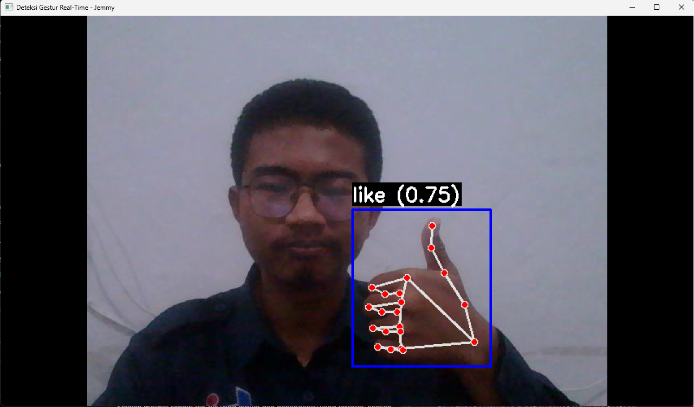
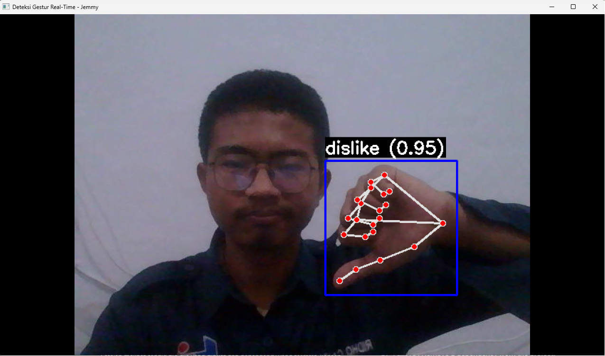
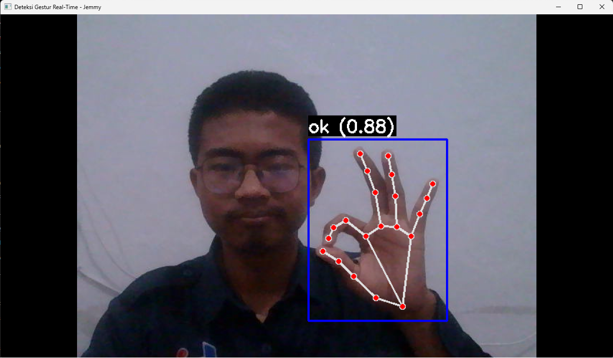
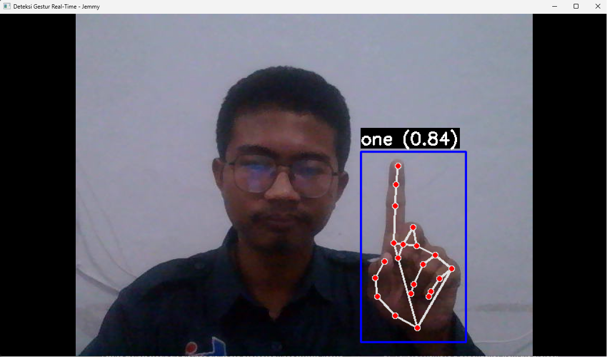
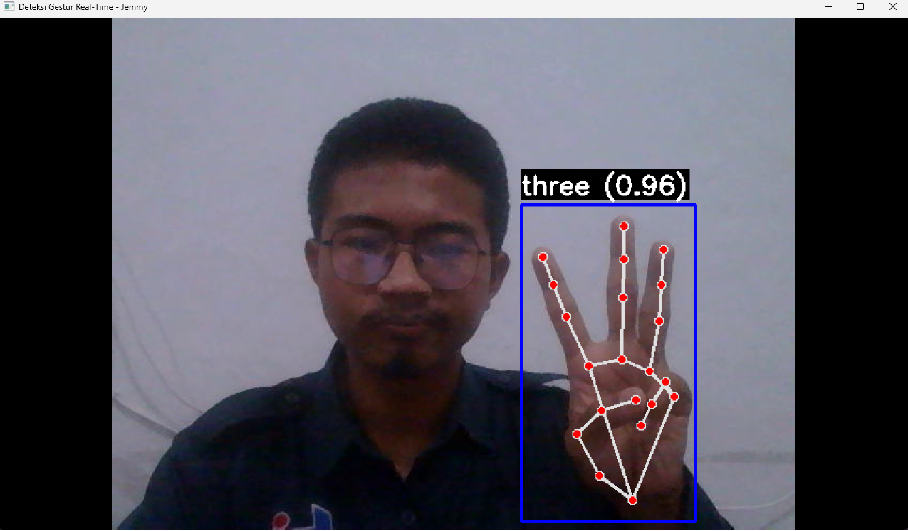
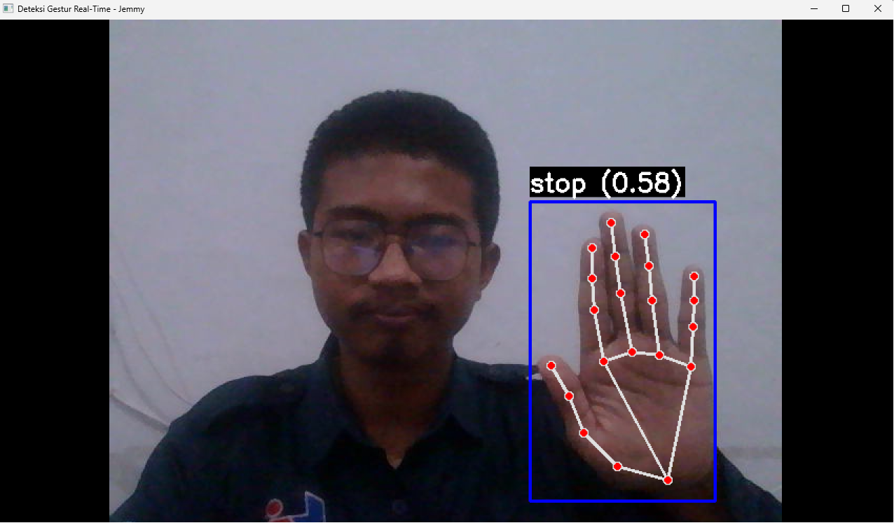

# Real-Time Hand Gesture Recognition

Sistem deteksi gestur tangan secara _real-time_ menggunakan webcam, MediaPipe, dan Machine Learning klasik — ringan, tanpa GPU.

---

## Overview

Proyek ini mengimplementasikan _pipeline_ lengkap untuk pengenalan gestur tangan: mulai dari konversi data anotasi mentah (JSON) menjadi dataset tabular (CSV), prapemrosesan koordinat tangan dengan algoritma normalisasi (translasi, skala, rotasi), pelatihan model klasifikasi menggunakan 4 algoritma berbeda, hingga inferensi _real-time_ melalui webcam dengan tampilan _bounding box_ dan _confidence score_.

Sistem mendeteksi 21 titik _landmark_ tangan menggunakan MediaPipe, menormalisasi koordinat agar kebal terhadap perubahan posisi, jarak, dan kemiringan tangan, lalu memprediksi gestur menggunakan model yang telah dilatih sebelumnya. Seluruh proses berjalan di CPU tanpa memerlukan GPU khusus.

---

## Tech Stack

| Kategori                | Teknologi                        | Versi    |
| ----------------------- | -------------------------------- | -------- |
| **Bahasa**              | Python                           | 3.10     |
| **Computer Vision**     | OpenCV (`cv2`)                   | 4.13     |
| **Hand Tracking**       | MediaPipe (`mp.solutions.hands`) | 0.10.9   |
| **Machine Learning**    | Scikit-Learn                     | 1.7.2    |
| **Model Serialization** | Pickle                           | Built-in |

---

## Key Features

- **Robust Normalization** — Algoritma `normalize_landmarks` yang menggeser pusat ke pergelangan tangan, menskalakan ukuran, dan memutar koordinat agar sejajar, membuat prediksi akurat lintas posisi dan jarak tangan.
- **Multiple Algorithm Options** — 4 _script_ pelatihan terpisah (SVC, RFC, GBC, MLP) untuk bereksperimen mencari model dengan akurasi terbaik.
- **Real-Time Bounding Box & Confidence Score** — Menampilkan kotak pendeteksi di sekitar tangan beserta label prediksi dan persentase keyakinan.
- **Auto-Scaling Window** — Jendela OpenCV mempertahankan rasio aspek secara otomatis saat di-_resize_.
- **CPU-Only Friendly** — Seluruh pipeline berjalan ringan di CPU tanpa dependensi GPU.

---

## Project Structure

```
gesture_recognition_practice/
├── dataset/
│   ├── ann_subsample/            # File anotasi JSON (input mentah)
│   ├── ann_test/                 # Data anotasi untuk pengujian
│   ├── ann_train_val/            # Data anotasi untuk training & validation
│   └── gestures_data.csv         # Dataset hasil ekstraksi (dibuat otomatis)
├── docs/
│   └── screenshot/               # Dokumentasi visual (screenshot & rekaman)
├── konversi_data.py              # Konversi JSON → CSV + normalisasi landmark
├── latih_model_GBC.py            # Training model Gradient Boosting
├── latih_model_MLP.py            # Training model Neural Network (MLP)
├── latih_model_RFC.py            # Training model Random Forest
├── latih_model_SVC.py            # Training model Support Vector Machine
├── run.py                        # Script utama deteksi real-time via webcam
├── requirements.txt              # Daftar dependensi Python
└── README.md
```

---

## Installation

### Prerequisites

- **Python 3.10** (wajib — MediaPipe 0.10.9 hanya kompatibel dengan versi ini)
- Webcam (internal atau eksternal)
- OS: Windows / macOS / Linux

### 1. Clone Repository

```bash
git clone https://github.com/username/gesture_recognition_practice.git
cd gesture_recognition_practice
```

### 2. Buat Virtual Environment

```bash
python -m venv env

# Aktivasi (Windows)
env\Scripts\activate

# Aktivasi (macOS / Linux)
source env/bin/activate
```

### 3. Install Dependencies

```bash
pip install -r requirements.txt
```

### 4. Siapkan Dataset

Dataset yang digunakan adalah **HaGRID (HAnd Gesture Recognition Image Dataset)** dari Kaggle.

```bash
# Install Kaggle CLI (jika belum)
pip install kaggle

# Download dataset
kaggle datasets download -d kapitanov/hagrid

# Ekstrak dan tempatkan folder anotasi ke dataset/
unzip hagrid.zip -d dataset/
```

Pastikan struktur folder sesuai:

```
dataset/
└── ann_subsample/    # File anotasi JSON dari HaGRID
```

> Dataset HaGRID: [https://www.kaggle.com/datasets/kapitanov/hagrid](https://www.kaggle.com/datasets/kapitanov/hagrid)

### 5. Konversi Data

Jalankan script untuk mengekstrak titik *landmark*, menormalisasi, dan menyimpan ke CSV:

```bash
python konversi_data.py
```

Hasilnya tersimpan di `dataset/gestures_data.csv`.

### 6. Latih Model

Pilih salah satu algoritma:

```bash
# Support Vector Machine
python latih_model_SVC.py

# Random Forest
python latih_model_RFC.py

# Gradient Boosting
python latih_model_GBC.py

# Neural Network (MLP)
python latih_model_MLP.py
```

Script akan menghasilkan file model `.pkl` (misal: `gesture_model_SVC.pkl`).

### 7. Jalankan Deteksi Real-Time

Pastikan nama file `.pkl` yang dimuat di `run.py` sesuai dengan model yang sudah dilatih. Lalu jalankan:

```bash
python run.py
```

Arahkan tangan ke kamera. Tekan **`q`** untuk menutup aplikasi.

---

## Engineering Value

- **Pipeline ML end-to-end** — Dari data mentah hingga inferensi _real-time_ dalam satu repo, cocok sebagai _template_ untuk proyek ML lain.
- **Feature engineering yang solid** — Normalisasi translasi-skala-rotasi menghilangkan variansi yang tidak relevan, meningkatkan akurasi model tanpa arsitektur kompleks.
- **Model comparison built-in** — 4 algoritma tersedia _out-of-the-box_, memudahkan _benchmarking_ tanpa ubah kode data.
- **CPU-first design** — Tidak butuh GPU, bisa dijalankan di _laptop_ standar — menjaga _barrier to entry_ rendah.
- **Reproducibility** — `random_state=42` dan `stratify=y` memastikan hasil konsisten antar _run_.

---

## Future Improvements

- [ ] Migrasi ke MediaPipe Tasks API (versi terbaru) untuk mengatasi deprekasi `mp.solutions`
- [ ] Penambahan gestur dan augmentasi data (rotasi, noise, occlusion) untuk robustness
- [ ] Implementasi _cross-validation_ dan _hyperparameter tuning_ (GridSearch / Optuna)
- [ ] Export model ke ONNX atau TFLite untuk inferensi di perangkat _edge_ (Raspberry Pi, mobile)
- [ ] Penambahan UI berbasis web (Streamlit / Flask) sebagai alternatif OpenCV window
- [ ] Logging & evaluasi otomatis (confusion matrix, per-class accuracy)

---

## Documentation

### Hasil Deteksi Real-Time

Berikut adalah contoh hasil deteksi gestur tangan secara *real-time*:

| Like | Dislike | OK |
|:---:|:---:|:---:|
|  |  |  |

| One | Three | Stop |
|:---:|:---:|:---:|
|  |  |  |

> Screenshot diambil langsung dari webcam saat menjalankan `run.py`.

---

## Author

**Mohammad Ridho Cahyono**

Full Stack Developer | Leadership Experience in Technology & Innovation

Developing Digital Solutions Through Web Development, Machine Learning, and IoT to Help Businesses and Organizations Grow.
